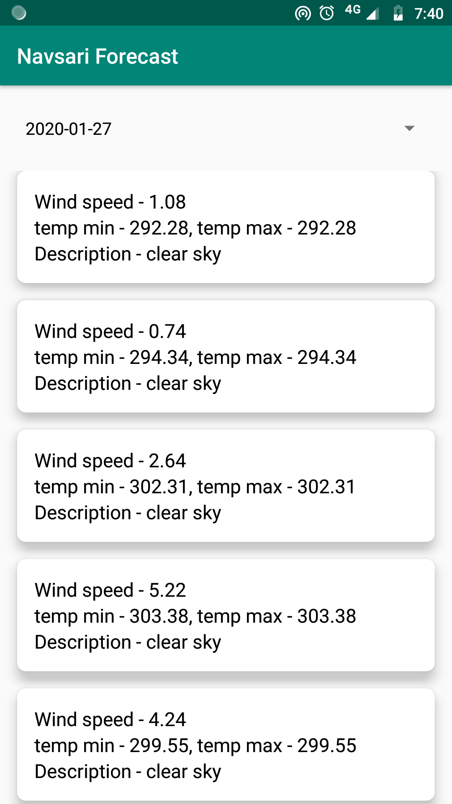
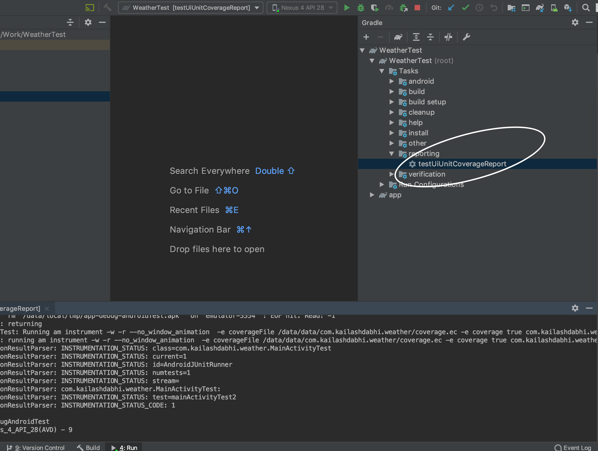

Weather App for Test
--------------------

Building Project:
----------------
__Requirement:__ Android Studio v3.5.3

Simply clone the project and click run button on android studio and it will install the app on your mobile.

Test
----

There is a 'testUiUnitCoverageReport' task defined in gradle files. So to run the test user needs to type in android studio terminal this command: './gradlew testUiUnitCoverageReport'.
Android studio user can also access this task directly by just opening gradle window just right side of android studio. In that gradle window user needs to go to Tasks->reporting->testUiUnitCoverageReport. Just double click the 'testUiUnitCoverageReport' task and it will do its job. :)

Notes
-----

For forecast, app needs to have last known location to run as the requirement says It should show
forecast for current location. So if mobile user deny the location permmission or he allowed location
permission but he forgot to turn on the location settings then user will not be able to see forecast.
In those cases App will show some error message.

